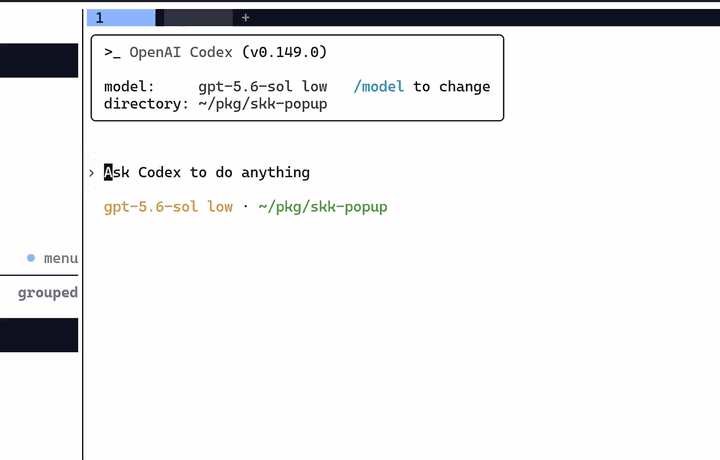

# skk-popup

Wails 製の常駐型 SKK ポップアップ入力窓。ホットキーで呼び出して日本語を入力し、確定文字列をクリップボードへ送ります。Linux/Wayland (Hyprland)・Windows・macOS に対応しています。

[chrome-skk-lite](https://github.com/takeshy/chrome-skk-lite) の「クリップボード入力窓」(`Ctrl+Shift+K`) をブラウザ外でも使えるようにした、独立したデスクトップアプリです。Chromium の起動モード (Ozone / Wayland) やバージョンに一切依存しません。



## 動作要件

| OS | 必要なもの |
|---|---|
| Linux + Wayland (Hyprland 推奨) | `wl-clipboard` (`wl-copy`)、WebKit2GTK 4.1、任意で `wtype` (自動貼り付け時) |
| Windows 10 以降 | 追加要件なし (ホットキーはアプリ内登録) |
| macOS | `osascript` が使う **Accessibility / Automation 権限**の許可 (自動貼り付けとフォーカス復帰時) |

## インストール

GitHub Releases からバイナリをダウンロードしてください。

```sh
# Linux
install -Dm755 skk-popup-linux-amd64 ~/.local/bin/skk-popup

# Windows (PowerShell)
# skk-popup-windows-amd64.exe を skk-popup.exe として PATH の通った場所へ

# macOS (Apple Silicon)
chmod +x skk-popup-darwin-arm64 && sudo mv skk-popup-darwin-arm64 /usr/local/bin/skk-popup
```

### Hyprland への登録

```ini
# ~/.config/hypr/hyprland.conf

windowrulev2 = float, class:^(skk-popup)$
windowrulev2 = center, class:^(skk-popup)$
windowrulev2 = pin, class:^(skk-popup)$
windowrulev2 = stayfocused, class:^(skk-popup)$
windowrulev2 = noborder, class:^(skk-popup)$
windowrulev2 = noanim, class:^(skk-popup)$

bind = CTRL SHIFT, K, exec, skk-popup toggle

exec-once = uwsm app -- skk-popup
```

- `stayfocused` が最重要です。これがないと窓が表示されてもキーボードフォーカスが移らず入力できません。
- 実際の `class` 名は `hyprctl clients` で確認し、必要なら正規表現を調整してください。
- `exec-once` でデーモンを常駐させます。二重起動しようとしても既存プロセスは壊れません。

### Windows

ホットキーはアプリ自身が `RegisterHotKey` で登録します(既定 `Ctrl+Shift+K`、`[hotkey]` セクションで変更・無効化可能)。自動起動はスタートアップフォルダにショートカットを置いてください (`Win+R` → `shell:startup`)。

フォーカス復帰は表示直前の前景ウィンドウを記憶して `SetForegroundWindow` で戻します。

### macOS

キーボードショートカットは OS 側の機能に委譲します (アプリ内では捕捉しません):

- [Shortcuts.app](https://support.apple.com/guide/shortcuts-mac/intro-to-shortcuts-apdfebc4f80a/mac) で「シェルスクリプトを実行」→ `skk-popup toggle` を作成し、ショートカットにキーを割り当てる
- または skhd / Raycast / Hammerspoon などから `skk-popup toggle` を呼ぶ

自動貼り付けとフォーカス復帰は System Events 経由で行うため、初回実行時に **Accessibility** と **Automation** の権限許可を求められます (`システム設定 > プライバシーとセキュリティ`)。自動起動は「ログイン項目」に登録してください。

macOS では設定の `paste_key` の `ctrl` は **Cmd** として扱われます (`ctrl+v` → Cmd+V)。

## 使い方

```text
skk-popup            デーモンを起動 (常駐)
skk-popup toggle     表示/非表示をトグル
skk-popup show       表示
skk-popup hide       非表示
skk-popup quit       デーモン終了
```

1. `Ctrl+Shift+K` (上記 bind) で入力窓を出す。窓は必ず `かな` モードで開きます
2. 窓の中で通常の SKK 操作で入力する
3. 未変換状態で `Enter` (または `Copy` ボタン) → 確定文字列がクリップボードにコピーされ、窓が閉じます
4. 直前のウィンドウへフォーカスが戻るので、貼り付ける

デーモンは辞書をメモリに保持したまま常駐するため、2 回目以降の表示は即時です。

## キー操作

chrome-skk-lite のクリップボード入力窓と同じ挙動です。

- 小文字ローマ字: かな入力
- 大文字で開始: 変換開始 (例: `Nihongo` → `▽にほんご`)
- 変換入力中の大文字: 送り仮名あり変換 (例: `KanJi` → `感じ`。`▽かん*じ` のように表示)
- `;`: sticky shift。変換開始 / 送り仮名開始位置の指定
- `Space`: 候補変換 / 次候補
- 5 候補目からは候補一覧を表示し、`A S D F J K L` で直接選択 (`Space`: 次ページ / `x`: 前ページ)
- 辞書注釈がある場合は `候補 ※注釈` の形で表示 (注釈は確定文字列に含まれない)
- 最後に確定した候補は、同じ読みの次回変換で優先表示
- 候補がない `Space` / 最終候補の次の `Space`: 単語登録モーダルを開く
- 登録モーダル内でもローマ字かな入力・候補変換・`q` / `Ctrl+Q` / `l` / `L` / `Ctrl+J` が使える
- 登録モーダル内で `\u3042` のように入力して `Enter`: Unicode 文字を挿入 (`¥u3042` / `￥u3042` でも可)
- 候補表示中の `x`: 前候補へ / 先頭で `x`: かな表示へ戻る
- 候補表示中の `X`: 表示中の候補をユーザー辞書・学習履歴から削除
- 候補表示中の `Ctrl+G`: 候補をキャンセルして変換バッファに戻る
- 変換入力中の `Tab`: 過去に変換した読みから補完
- 読みに数字を含めると数値変換 (例: `だい5かい` → `第５回` / `第五回`)
- 変換入力中の `>`: 接頭辞変換 (例: `ちょう>` → `超`) / `▽>`: 接尾辞入力
- 変換入力中の `q`: カタカナで確定 (`Ctrl+Q`: 半角カタカナで確定)
- 非変換時の `q` / `Ctrl+Q`: カタカナ入力モード切替 (`SKK カナ` / `SKK 半ｶﾅ`)
- `l`: 英数モード (`SKK OFF`) へ / `L`: 全角英数モードへ / `Ctrl+J`: かなモードへ
- 空のかな入力状態で `/`: Abbrev モード (`▽/word`)。`//` で `/` を確定入力
- `zh zj zk zl` → `←↓↑→` / `z Space` → 全角スペース / `z. z, z- z/ z[ z]` → `… ‥ ～ ・ 『 』`
- `Shift+Enter`: 改行
- `Escape`: 変換中はキャンセル / 未変換状態なら窓を閉じる (コピーしない)
- `Enter`(未変換) / `Copy`: コピーして窓を閉じる

状態は窓下部のステータスバー (`SKK かな` / `SKK OFF` / ...) に表示されます。

## 設定

Linux: `~/.config/skk-popup/config.toml` / Windows: `%AppData%\skk-popup\config.toml` / macOS: `~/Library/Application Support/skk-popup/config.toml`

```toml
[window]
width = 600
height = 240
# 閉じたあとに直前のウィンドウへフォーカスを戻す
restore_focus = true

[clipboard]
# "wl-copy" | "wails" (既定: Linux=wl-copy, Windows/macOS=wails)
backend = "wl-copy"
# コピー後に自動で貼り付けショートカットを送出 (Linux: wtype, Windows: SendInput, macOS: osascript)
auto_paste = true
# 自動貼り付け時、フォーカス復帰から送出までの待ち時間 (ミリ秒)
auto_paste_delay_ms = 80
# "ctrl+v" | "ctrl+shift+v"
# foot/alacritty/kitty などの多くのターミナルは Ctrl+V を readline の「次の
# 文字をリテラル入力」に使うため貼り付けに反応せず、ctrl+shift+v が必要。
# GUI アプリ (ブラウザ・GTK/Qt) は主に ctrl+v だが ctrl+shift+v も通ることが
# 多いため、デフォルトは ctrl+shift+v。貼り付け先で反応しない場合は ctrl+v に
paste_key = "ctrl+shift+v"

[hotkey]
# Windows のみ有効。アプリ内でグローバルホットキーを登録する (RegisterHotKey)。
# 既定は Windows のみ true (Linux は Hyprland bind、macOS は OS のショートカット
# 機能に委譲するため、他 OS では設定しても無視される)
enabled = true
accelerator = "Ctrl+Shift+K"   # A-Z, 0-9, F1-F24 + Ctrl/Shift/Alt/Win

[dictionary]
# 外部辞書ファイルのパス。指定するとバイナリ埋め込みより優先される (省略可)
external_path = ""
```

## データファイル

| ファイル | Linux | Windows | macOS |
|---|---|---|---|
| ユーザー辞書 (`userdict.json`) | `$XDG_DATA_HOME/skk-popup/` | `%LocalAppData%\skk-popup\` | `~/Library/Application Support/skk-popup/` |
| 学習履歴 (`history.json`) | 同上 | 同上 | 同上 |

書き込みは最終更新 2 秒後にデバウンスフラッシュされ、窓を閉じるタイミングでも必ずフラッシュされます。

## 自前でビルドする

前提:

- Go 1.23 以降 (リポジトリには `.mise.toml` を同梱しています)
- Node.js 22 以降
- Linux のみ: `libgtk-3-dev` と `libwebkit2gtk-4.1-dev` 相当のパッケージ (Arch なら `webkit2gtk-4.1`)。Windows/macOS は追加パッケージ不要 (macOS ビルドは Xcode command line tools)
- `https://skk-dev.github.io/dict/` にアクセスできるネットワーク環境 (初回のみ)

```sh
cd frontend && npm run build && cd ..   # 辞書取得 (~50MB) + dist 生成。2 回目以降は辞書をスキップ
go install github.com/wailsapp/wails/v3/cmd/wails3@v3.0.0-beta.12
wails3 task linux:build ARCH=amd64       # Linux
# wails3 task windows:build ARCH=amd64   # Windows
# wails3 package GOOS=windows GOARCH=arm64 FORMAT=msix  # Windows MSIX
install -Dm755 bin/skk-popup ~/.local/bin/skk-popup
```

- LinuxビルドはWails v3の `gtk3` タグを使用し、WebKit2GTK 4.1環境との互換性を維持します。
- 使用する辞書はルートの `dictionary_sources.json` で変更できます。再生成する場合は `node scripts/build_dictionary.js --force`。
- バイナリは約 13MB の辞書を embed します。肥大が気になる場合は `dictionary.external_path` に外部ファイルを指定するとそちらが優先されます。

開発モード:

```sh
wails3 dev
```

テスト:

```sh
node tests/skk_engine.test.js      # 変換エンジン
node tests/skk_clipboard.test.js   # 入力窓の操作フロー (Wails ブリッジをフェイクで置き換え)
go test ./...
```

## デプロイ

`v*` タグを push すると GitHub Actions が linux/amd64・linux/arm64・windows/amd64・windows/arm64・darwin/arm64 のバイナリをビルドし、draft リリースを作成します (`.github/workflows/release.yml`)。

## アーキテクチャ

```text
Hyprland bind ──▶ skk-popup toggle ──▶ Unix socket ($XDG_RUNTIME_DIR/skk-popup.sock)
                                        │
                                        ▼
                     skk-popup デーモン (常駐)
                     ├─ IPC server (toggle/show/hide/quit)
                     ├─ AssetServer (/dictionary.json を WebView へ配信)
                     ├─ ユーザー辞書・学習履歴の永続化
                     ├─ wl-copy によるクリップボード転送
                     └─ WebKit2GTK フロントエンド (skk_engine.js + 入力窓 UI)
```

- システム辞書はバイナリに embed され、WebView から `fetch('/dictionary.json')` で直接読み込まれます (JS↔ネイティブブリッジを通さない)
- グローバルホットキーはアプリ側で捕捉せず、Hyprland の `bind` に完全に委譲します
